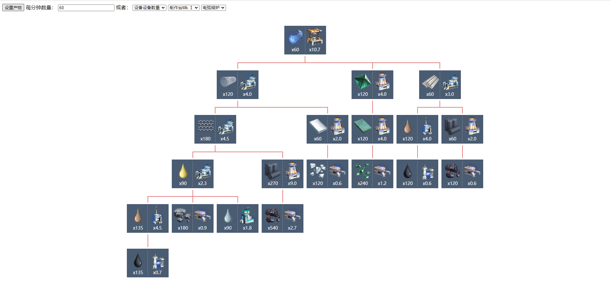

# Introduction

> A Dyson Sphere Program production tool

## Build

``` bash
# install dependencies
npm install

# serve with hot reload at localhost:8080
npm run dev

# build for production with minification
npm run build
```
## Demo

demo screenshot



demo site

https://dyson.luwake.com/

## Todo

updated content needs to be completed
